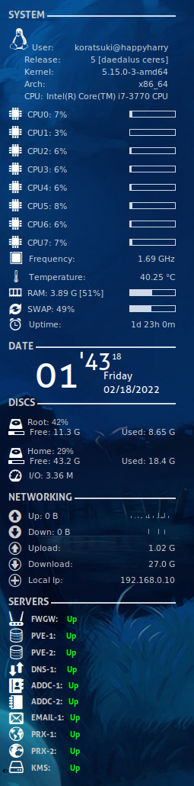

My current Conky config
==

[Preview](images/preview.png "Preview")




**Author**: *Koratsuki*

**Twitter**: *https://twitter.com/Koratsuki84*

**Version**: *1.11.6*

**License**: *Distributed under the terms of GNU GPL version 2 or later*

**Based on**: [Smooth_Conky style by fabtk](https://www.deviantart.com/fabtk/art/smooth-conky-style-157104223)

**Status**: *Work in progress*

**Updated**: *Some new icons, and minor fixes.*

## How to use this:

### Requirements

**Requires**: lm-sensors and lsb-release

**Install**: ```# apt install conky-all lm-sensors lsb-release```

### And what now?

For example: Clone this repo, put it on your home folder under any name, **.conky**, and fonts folder in **.fonts** folder under your home. You will need to compile your font cache. Run:

```# fc-cache -f```

And call the config file with:

```# conky -c /home/$USER/.conky/conky.cfg```

Put that line on system start, and you're done!

## Notes

*Note 1: I use Devuan, and Devuan uses old style networking interfaces names, so, you might change wlan0 and eth0 for wlp5s0 and enp0s1. Thanks systemd/udev.*

Read this:

[Network interfaces renaming](https://www.freedesktop.org/wiki/Software/systemd/PredictableNetworkInterfaceNames/)

Regards! 
